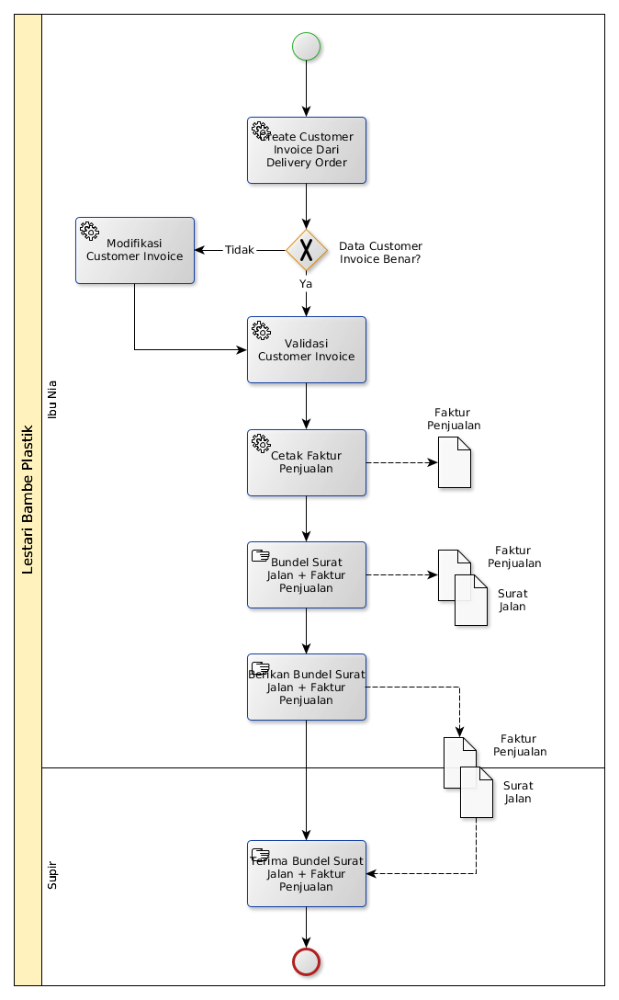

# Pembuatan Surat Jalan dan Faktur Penjualan

## A. START

## B. INSTRUKSI KERJA

### B.1. Membuat Customer Invoice Dari Delivery Order

#### B.1.1. Instruksi Kerja Utama

[Odoo - Inventory: 1.14.6](https://open-synergy.github.io/mdbook-inventory/transaksi/delivery-order/invoice.html)

### B.2. Memodifikasi Customer Invoice

#### B.1.1. Instruksi Kerja Utama

[Odoo - Finance & Accounting: 2.2.3](https://open-synergy.github.io/mdbook-fa/transaksi/customer-invoice/modifikasi.html)

### B.3. Validasi Customer Invoice

#### B.1.1. Instruksi Kerja Utama

[Odoo - Finance & Accounting: 2.2.5](https://open-synergy.github.io/mdbook-fa/transaksi/customer-invoice/validasi.html)

### B.4. Cetak Faktur Penjualan

#### B.1.1. Instruksi Kerja Utama

[Instruksi Kerja Tambahan: 1.4](https://open-synergy.github.io/mdbook-lbp//instruksi/cetak-faktur-penjualan.html)
