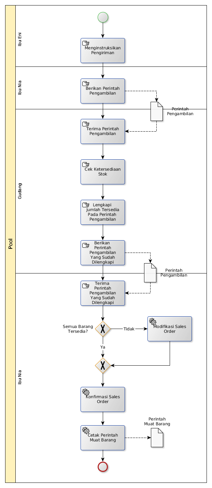

# Konfirmasi Pesanan

## A. START

## B. INSTRUKSI KERJA

### B.1. Modifikasi Sales Order

#### B.1.1. Instruksi Kerja Utama

[Odoo - Sales Management: 1.1.3](https://open-synergy.github.io/mdbook-sale/transaksi/sales-order/modifikasi.html)

### B.2. Konfirmasi Sales Order

#### B.2.1. Instruksi Kerja Utama

[Odoo - Sales Management: 1.1.9](https://open-synergy.github.io/mdbook-sale/transaksi/sales-order/konfirmasi.html)

### B.3. Cetak Perintah Muat Barang

#### B.3.1. Instruksi Kerja Utama

[Instruksi Kerja Tambahan: 1.1](https://open-synergy.github.io/mdbook-lbp//instruksi/cetak-perintah-muat-barang.html)
