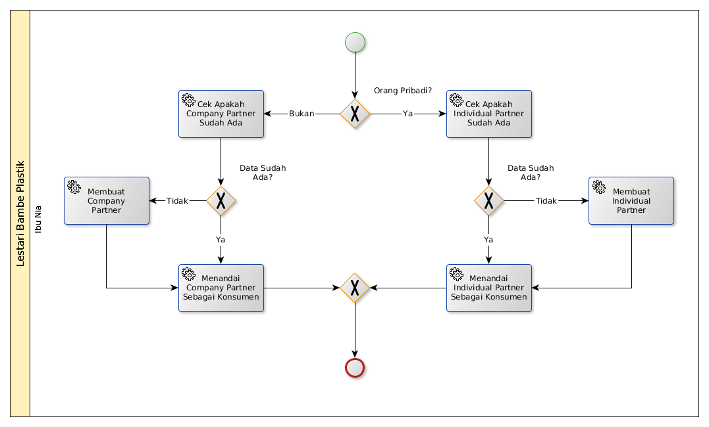

# Mendata Konsumen

## A. START

* Data konsumen dibutuhkan

## B. INSTRUKSI KERJA

### B.1. Membuat Company Partner

#### B.1.1. Instruksi Kerja Utama

[Odoo - Partner Management: 1.3](https://open-synergy.github.io/mdbook-partner/company-partner/membuat.html)

### B.2. Menandai Company Partner Sebagai Konsumen

#### B.2.1. Instruksi Kerja Utama

[Odoo - Partner Management: 1.6](https://open-synergy.github.io/mdbook-partner/company-partner/mark-as-customer.html)

### B.3. Cek Apakah Company Partner Sudah Ada

#### B.3.1. Instruksi Kerja Utama

#TODO

### B.4. Membuat Company Partner

#### B.4.1. Instruksi Kerja Utama

[Odoo - Partner Management: 2.3](https://open-synergy.github.io/mdbook-partner/individual-partner/membuat.html)

### B.5. Menandai Company Partner Sebagai Konsumen

#### B.5.1. Instruksi Kerja Utama

[Odoo - Partner Management: 2.6](https://open-synergy.github.io/mdbook-partner/individual-partner/mark-as-customer.html)

### B.6 Cek Apakah Individual Partner Sudah Ada

#### B.6.1. Instruksi Kerja Utama

#TODO
