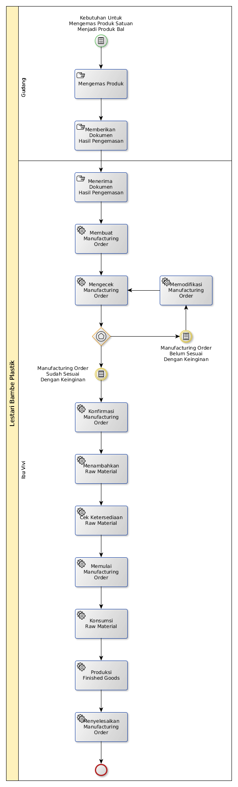

# Pencatatan Hasil Pengemasan

## A. START

Ada kebutuhan untuk mengemas produk satuan menjadi produk bal

## B. LANGKAH KERJA

### B.1. Membuat Manufacturing Order

#### B.1.1. Instruksi Kerja Utama

[Odoo - Manufacturing: 1.1.2](https://open-synergy.github.io/mdbook-manufacture/transaksi/mo/membuat.html)

* Langkah ke-8, 10, 11, 12, 13, 14, 15, 16, 17 tidak perlu dilakukan
* Langkah ke-3 diisi dengan nama **Packaging**.
* Langkah ke-4 diisi dengan produk yang diproduksi. Pilihlah produk bal nya.
* Langkah ke-5 diisi dengan **Unit**.
* Langkaah ke-7 diisi dengan tanggal pengemasan selesai dilakukan.

### B.2. Mengkonfirmasi Manufacturing Order

#### B.2.1. Instruksi Kerja Utama

[Odoo - Manufacturing: 1.1.5](https://open-synergy.github.io/mdbook-manufacture/transaksi/mo/konfirmasi.html)

### B.3. Memulai Manufacturing Order

#### B.3.1. Instruksi Kerja Utama

[Odoo - Manufacturing: 1.1.8](https://open-synergy.github.io/mdbook-manufacture/transaksi/mo/mulai.html)

### B.4. Menambahkan Raw Material

#### B.4.1. Instruksi Kerja Utama

[Odoo - Manufacturing: 1.1.6](https://open-synergy.github.io/mdbook-manufacture/transaksi/mo/tambah-rm.html)

* Langkah ke-6 diisi dengan produk satuan yang dikemas.
* Langkah ke-7 diisi dengan jumlah produk satuan yang digunakan.

### B.5. Konsumsi Raw Material

#### B.5.1. Instruksi Kerja Utama

[Odoo - Manufacturing: 1.1.9](https://open-synergy.github.io/mdbook-manufacture/transaksi/mo/konsumsi.html)

* Langkah ke-6 disii dengan tanggal pengemasan selesai dilakukan.

### B.6. Produksi Finished Goods

#### B.6.1. Instruksi Kerja Utama

[Odoo - Manufacturing: 1.1.10](https://open-synergy.github.io/mdbook-manufacture/transaksi/mo/produksi.html)

### B.7. Menyelesaikan Manufacturing Order

#### B.7.1. Instruksi Kerja Utama

[Odoo - Manufacturing: 1.1.11](https://open-synergy.github.io/mdbook-manufacture/transaksi/mo/selesai.html)
