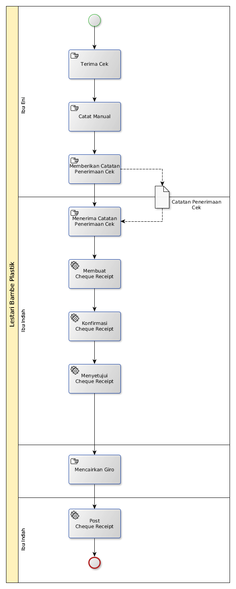

# Penerimaan Menggunakan Cek

## A. START

## B. INSTRUKSI KERJA

### B.1. Membuat Cheque Receipt

#### B.1.1. Instruksi Kerja Utama
[
Odoo - Finance & Accounting: 2.12.2](https://open-synergy.github.io/mdbook-fa/transaksi/cheque-receipt/membuat.html)

### B.2. Konfirmasi Cheque Receipt

#### B.2.1. Instruksi Kerja Utama
[
Odoo - Finance & Accounting: 2.12.9](https://open-synergy.github.io/mdbook-fa/transaksi/cheque-receipt/konfirmasi.html)

### B.3. Menyetujui Cheque Receipt

#### B.3.1. Instruksi Kerja Utama

[Odoo - Finance & Accounting: 2.12.10](https://open-synergy.github.io/mdbook-fa/transaksi/cheque-receipt/approve.html)

### B.4. Post Cheque Receipt

#### B.4.1. Instruksi Kerja Utama

[Odoo - Finance & Accounting: 2.12.12](https://open-synergy.github.io/mdbook-fa/transaksi/cheque-receipt/post.html)
