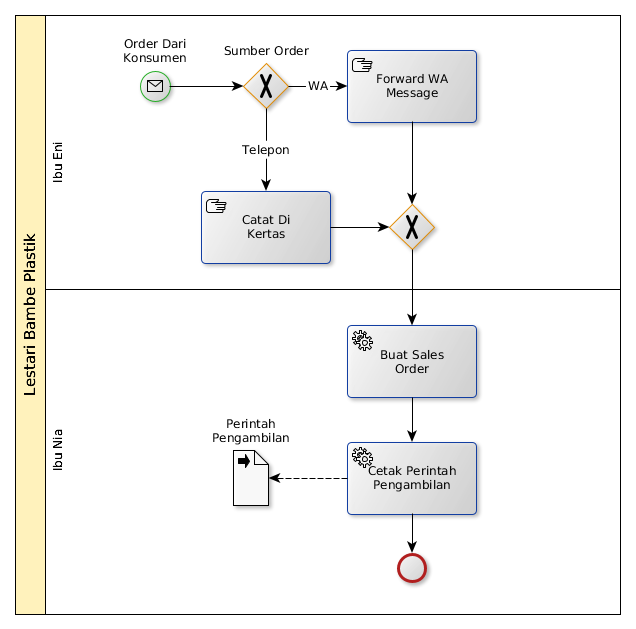

# Penerimaan Pesanan

### A. Buat Sales Order

#### A.1 Manual

Lihat [Odoo - Sales Management Chapter 1.1.2](https://open-synergy.github.io/mdbook-sale/transaksi/sales-order/membuat.html)

#### A.2 Instruksi Spesifik Chapter 1.1.2

* Langkah ke-7, 9, 10, 15, 17 - 25 tidak perlu dilakukan
* Langkah ke-3 diisi dengan:

    * Nama konsumen pada transaksi normal
    * Nama *dropshipper* pada transaksi dropshipping
* Langkah ke-5 diisi dengan nama ekspedisi jika menggunakan ekpedisi.
* Langkah ke-6 diisi dengan name konsumen

#### A.2 Instruksi Spesifik Chapter 1.1.2.1

* Langkah ke-3, 6-9, 12, 14-21 tidak perlu dilakukan

### B. Cetak Perintah Pengambilan

#### B.1 Manual

Lihat [Instruksi Kerja Tambahan - Cetak Perintah Pengambilan](../instruksi/cetak-perintah-pengambilan.md)
