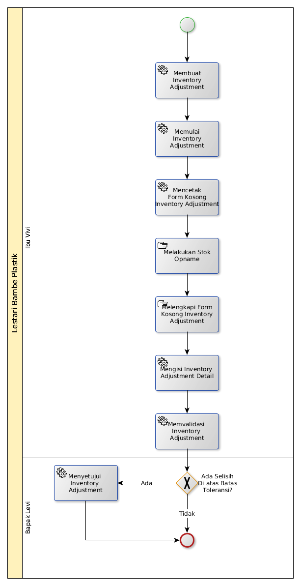

# Stok Opname

## A. START

## B. INSTRUKSI KERJA

### B.1. Membuat Inventory Adjustment

#### B.1.1 Instruksi Kerja Utama

[Odoo - Inventory: 1.23.3](https://open-synergy.github.io/mdbook-inventory/transaksi/inventory-adjustment/membuat.html)

### B.2. Memulai Inventory Adjustment

#### B.2.1 Instruksi Kerja Utama

[Odoo - Inventory: 1.23.7](https://open-synergy.github.io/mdbook-inventory/transaksi/inventory-adjustment/memulai.html)

### B.3. Mencetak Form Kosong Inventory Adjustment

#### B.3.1 Instruksi Kerja Utama

[Odoo - Inventory: 1.23.7](https://open-synergy.github.io/mdbook-inventory/transaksi/inventory-adjustment/memulai.html)

### B.4. Mengisi Inventory Adjustment Detail

#### B.4.1 Instruksi Kerja Utama

[Odoo - Inventory: 1.23.8](https://open-synergy.github.io/mdbook-inventory/transaksi/inventory-adjustment/inventory-detail.html)

### B.5. Memvalidasi Inventory Adjustment

#### B.5.1 Instruksi Kerja Utama

[Odoo - Inventory: 1.23.10](https://open-synergy.github.io/mdbook-inventory/transaksi/inventory-adjustment/memvalidasi.html)

### B.6. Menyetujui Inventory Adjustment

#### B.6.1 Instruksi Kerja Utama

[Odoo - Inventory: 1.23.9]https://open-synergy.github.io/mdbook-inventory/transaksi/inventory-adjustment/menyetujui.html
